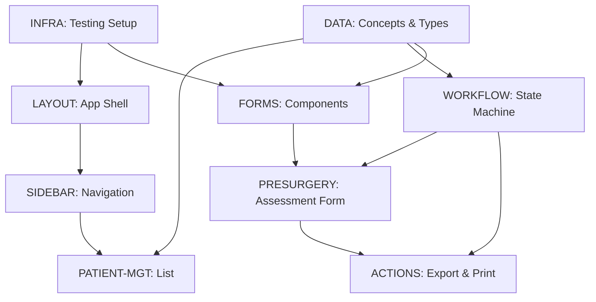

# Augen Auf OpenMRS Module - Backlog

**Project**: Ophthalmology Patient Management System
**Target**: OpenMRS 3.x ESM Framework
**Status**: Discovery & Planning Phase
**Last Updated**: 2025-10-10

## 🎯 Vision

Implement a comprehensive ophthalmology module for pre-surgery assessment and patient workflow management, supporting bilateral eye examinations with cataract classification, BCVA measurements, and protocol-based treatment paths.

---

## 🏗️ Work Streams (Parallelizable)

### STREAM 1: INFRA - Testing & Quality Infrastructure
**Owner**: Unassigned
**Dependencies**: None (can start immediately)
**Estimated Effort**: 2-3 hours

#### Tasks:
- [ ] Create `scripts/test.sh` - Unified test runner with --watch support
- [ ] Create `scripts/quality-gate.sh` - Combined linter + type-check + tests
- [ ] Create `scripts/check-types.sh` - TypeScript validation (handle OpenMRS dependency issues)
- [ ] Create `scripts/check-lint.sh` - ESLint runner
- [ ] Create `scripts/agent-cleanup.sh` - Pre-commit cleanup automation
- [ ] Create `scripts/pre-commit-check.sh` - Security scan + quality validation
- [ ] Configure Jest + React Testing Library for OpenMRS modules
- [ ] Add test:watch script to package.json
- [ ] Document testing strategy in `docs/testing.md`

**Acceptance Criteria**:
- All scripts executable and tested
- Scripts output minimal info on GREEN, full details on RED
- Zero tolerance quality gate (no warnings)

---

### STREAM 2: DATA - OpenMRS Concepts & Data Model
**Owner**: Unassigned
**Dependencies**: None (can start immediately)
**Estimated Effort**: 4-6 hours

#### Tasks:
- [ ] Define OpenMRS concepts for ophthalmology domain:
  - [ ] Cataract types (Incipiens, Corticalis et nucl, Subcaps post, Polaris posterior, Brunescens, Matura, Intumescens)
  - [ ] Eye laterality (Right/Left/Both)
  - [ ] BCVA measurement (decimal format)
  - [ ] Astigmatism (diopters)
  - [ ] Pterygium classification
  - [ ] Anesthesia types (ic, st/pb, AN)
  - [ ] Axial length measurement (from limbus, mm)
- [ ] Design form schema for pre-surgery assessment
- [ ] Create TypeScript types for all medical data structures
- [ ] Define validation rules for measurements (ranges, required fields)
- [ ] Create mock data generator for development/testing
- [ ] Document concept mappings in `docs/openmrs-concepts.md`

**Acceptance Criteria**:
- All concepts documented with OpenMRS UUID patterns
- TypeScript types exported from `src/types/medical.ts`
- Validation rules unit tested
- Mock data available for UI development

---

### STREAM 3: LAYOUT - Application Shell & Navigation
**Owner**: Unassigned
**Dependencies**: INFRA (testing setup)
**Estimated Effort**: 3-4 hours

#### Tasks:
- [ ] **TDD**: Write tests for responsive layout component
- [ ] Implement main app shell with header/sidebar/content areas
- [ ] Create responsive grid system (mobile/tablet/desktop)
- [ ] Implement top navigation bar with:
  - [ ] OpenMRS branding integration
  - [ ] Queue indicator
  - [ ] Settings menu (top-right grid icon)
- [ ] Create `src/components/Layout/AppShell.tsx`
- [ ] Create `src/components/Layout/TopNav.tsx`
- [ ] Add CSS/styled-components for layout primitives
- [ ] Test layout on mobile/tablet viewports

**Acceptance Criteria**:
- Tests pass for all breakpoints
- Layout adapts to OpenMRS shell
- No hardcoded dimensions (use CSS Grid/Flexbox)

---

### STREAM 4: SIDEBAR - Workflow Navigation & Patient Filtering
**Owner**: Unassigned
**Dependencies**: LAYOUT
**Estimated Effort**: 4-5 hours

#### Tasks:
- [ ] **TDD**: Write tests for sidebar navigation component
- [ ] Implement sidebar with collapsible sections:
  - [ ] Date filter (Today, Interval)
  - [ ] Patient search input
  - [ ] Workflow stage navigation (Registration → Refraction → Eye Exam → Therapy → Finished)
  - [ ] "Needs surgery>" filter
- [ ] Create `src/components/Sidebar/WorkflowNav.tsx`
- [ ] Create `src/components/Sidebar/DateFilter.tsx`
- [ ] Create `src/components/Sidebar/PatientSearch.tsx`
- [ ] Implement active state highlighting
- [ ] Add keyboard navigation support
- [ ] Wire up to global state (see WORKFLOW stream)

**Acceptance Criteria**:
- Sidebar navigation functional with routing
- Filter state managed in global store
- Keyboard accessible (Tab, Enter, Arrow keys)
- Tests cover all filter combinations

---

### STREAM 5: PATIENT-MGT - Patient List & Selection
**Owner**: Unassigned
**Dependencies**: DATA (types), SIDEBAR (filter state)
**Estimated Effort**: 3-4 hours

#### Tasks:
- [ ] **TDD**: Write tests for patient list component
- [ ] Implement patient list with:
  - [ ] Active patient display (Patient 002, 003, 005)
  - [ ] Completed patient styling (grayed out)
  - [ ] Click-to-select interaction
  - [ ] Highlight selected patient
- [ ] Create `src/components/Patients/PatientList.tsx`
- [ ] Create `src/components/Patients/PatientListItem.tsx`
- [ ] Integrate with OpenMRS patient search API
- [ ] Add "Add new patient" button integration
- [ ] Implement patient selection state management
- [ ] Add loading/error states

**Acceptance Criteria**:
- Patient list fetches from OpenMRS API
- Selection state synced with URL params
- Handles empty state and errors gracefully
- Pagination if >20 patients

---

### STREAM 6: WORKFLOW - State Machine for Patient Journey
**Owner**: Unassigned
**Dependencies**: DATA (types)
**Estimated Effort**: 5-6 hours

#### Tasks:
- [ ] **TDD**: Write tests for workflow state machine
- [ ] Design state machine for patient workflow:
  ```
  Registration → Refraction → Eye Exam → [Surgery Decision] → Therapy → Finished
                                              ↓
                                         Needs Surgery (Pre-Surgery Form)
  ```
- [ ] Implement state transitions with validation
- [ ] Create `src/state/workflowMachine.ts` (using XState or custom)
- [ ] Create `src/state/workflowContext.tsx` (React Context)
- [ ] Add transition hooks (onEnter, onExit for each stage)
- [ ] Persist workflow state to OpenMRS observations
- [ ] Add audit trail for state changes
- [ ] Create workflow visualization component (optional)

**Acceptance Criteria**:
- State machine prevents invalid transitions
- State persisted to OpenMRS backend
- All transitions unit tested
- Workflow state accessible via React hooks

---

### STREAM 7: FORMS - Reusable Form Components
**Owner**: Unassigned
**Dependencies**: DATA (types), INFRA (testing)
**Estimated Effort**: 6-8 hours

#### Tasks:
- [ ] **TDD**: Write tests for all form components
- [ ] Create bilateral input component (left/right eye symmetry):
  - [ ] `src/components/Forms/BilateralInput.tsx`
  - [ ] Supports copy left→right, right→left
  - [ ] Visual indication of symmetry/asymmetry
- [ ] Create checkbox group component:
  - [ ] `src/components/Forms/CheckboxGroup.tsx`
  - [ ] Supports multi-select with validation
  - [ ] Cataract type selector variant
- [ ] Create measurement input component:
  - [ ] `src/components/Forms/MeasurementInput.tsx`
  - [ ] Handles units (dpt, mm, decimal)
  - [ ] Range validation with visual feedback
- [ ] Create BCVA input component:
  - [ ] `src/components/Forms/BCVAInput.tsx`
  - [ ] Decimal format (0.0 - 1.0)
  - [ ] Conversion helpers (Snellen, LogMAR)
- [ ] Create radio button group for anesthesia:
  - [ ] `src/components/Forms/RadioGroup.tsx`
- [ ] Add form validation library integration (React Hook Form or Formik)
- [ ] Create form state persistence (auto-save)

**Acceptance Criteria**:
- All components unit tested with Jest
- Storybook stories for visual testing (optional but recommended)
- Validation errors displayed inline
- Components follow OpenMRS Carbon design system

---

### STREAM 8: PRESURGERY - Pre-Surgery Assessment Form
**Owner**: Unassigned
**Dependencies**: FORMS (components), DATA (schema), WORKFLOW (state)
**Estimated Effort**: 8-10 hours (COMPLEX)

#### Tasks:
- [ ] **TDD**: Write tests for form validation rules
- [ ] Implement pre-surgery form layout:
  - [ ] Form header with Patient ID
  - [ ] Bilateral layout (Right eye | Left eye columns)
- [ ] Right eye section:
  - [ ] Cataract BCVA input (decimal)
  - [ ] Cataract type checkboxes (7 types)
  - [ ] Pseudophakie checkbox
  - [ ] Pterygium section with "necessary before surgery" flag
  - [ ] Astigmatism measurement (dpt)
  - [ ] Axial length (from limbus, mm)
  - [ ] Anesthesia options (ic/st/pb/AN)
- [ ] Left eye section (mirror of right eye)
- [ ] Create `src/components/PreSurgery/PreSurgeryForm.tsx`
- [ ] Create `src/components/PreSurgery/EyeAssessment.tsx`
- [ ] Implement form submission to OpenMRS encounters
- [ ] Add form validation (required fields, value ranges)
- [ ] Implement auto-save every 30 seconds
- [ ] Add "Copy from right eye" / "Copy from left eye" shortcuts
- [ ] Handle partially completed forms (save draft)

**Acceptance Criteria**:
- Form passes all validation tests
- Data saved to OpenMRS encounters with correct concept mappings
- Form state persists across browser refresh
- Bilateral data can be copied between eyes
- Error handling for save failures

---

### STREAM 9: ACTIONS - Protocol Management & Export
**Owner**: Unassigned
**Dependencies**: PRESURGERY (form data), WORKFLOW (state)
**Estimated Effort**: 4-5 hours

#### Tasks:
- [ ] **TDD**: Write tests for protocol switching
- [ ] Implement protocol tabs (Protocol 1, 2, 3):
  - [ ] `src/components/Protocols/ProtocolTabs.tsx`
  - [ ] Load protocol-specific forms
  - [ ] Persist active protocol per patient
- [ ] Implement PRINT functionality:
  - [ ] Generate PDF from form data
  - [ ] Include patient demographics
  - [ ] Format for clinical use
  - [ ] `src/services/printService.ts`
- [ ] Implement "Link to Database" export:
  - [ ] Export to external statistics DB (if applicable)
  - [ ] CSV/JSON export options
  - [ ] `src/services/exportService.ts`
- [ ] Create protocol configuration schema
- [ ] Add protocol-specific validation rules

**Acceptance Criteria**:
- Protocol switching preserves unsaved data (with confirmation)
- Print output matches clinical requirements
- Export includes all required fields
- All actions logged for audit trail

---

## 🔗 Dependency Graph



---

## 🚀 Quickstart for Agents

### 1. Claim a Task
```bash
# Find available tasks
grep "- \[ \]" BACKLOG.md

# Claim a task by adding your agent ID
sed -i '' 's/- \[ \] Create/- [ ] 🔒 [AGENT-1234567890] Create/' BACKLOG.md
```

### 2. Start TDD Workflow
```bash
# RED: Write failing test first
./scripts/test.sh <module> --watch

# GREEN: Implement minimal code
./scripts/test.sh <module>

# REFACTOR: Clean while green
./scripts/test.sh <module> --watch
```

### 3. Run Quality Gate Before Commit
```bash
./scripts/quality-gate.sh  # Must be 100% GREEN
./scripts/agent-cleanup.sh
git commit -m "Add <feature> to <achieve value>"
```

---

## 📋 Current Sprint Focus

**Iteration 1: Foundation** (Weeks 1-2)
- STREAM 1: INFRA (must complete first)
- STREAM 2: DATA (parallel to INFRA)
- STREAM 3: LAYOUT (after INFRA)

**Iteration 2: Core Features** (Weeks 3-4)
- STREAM 4: SIDEBAR
- STREAM 5: PATIENT-MGT
- STREAM 6: WORKFLOW
- STREAM 7: FORMS (start early, longest stream)

**Iteration 3: Main Feature** (Weeks 5-6)
- STREAM 8: PRESURGERY (requires FORMS completion)

**Iteration 4: Polish** (Week 7)
- STREAM 9: ACTIONS
- Integration testing
- User acceptance testing

---

## 🔐 Agent Locks

**Format**: `🔒 [AGENT-{ID}] {task} - {timestamp}`

Example:
```markdown
- [ ] 🔒 [AGENT-1728561234] Create scripts/test.sh - 2025-10-10T14:30:00Z
```

**Lock expiration**: 15 minutes of inactivity = stale lock

---

## ✅ Completion Checklist

Before marking the project DONE:

- [ ] All 9 streams completed
- [ ] E2E tests pass for full patient workflow
- [ ] Documentation complete (user guide, API docs)
- [ ] Performance tested (load 100+ patients)
- [ ] Accessibility audit passed (WCAG 2.1 AA)
- [ ] Security review completed (no PII leaks)
- [ ] OpenMRS community demo prepared
- [ ] Deployment guide for production

---

**VERSION**: 1.0.0
**PROTOCOL**: Agent Protocol v1.1
**ENFORCEMENT**: TDD Mandatory | Quality Gate Zero-Tolerance
