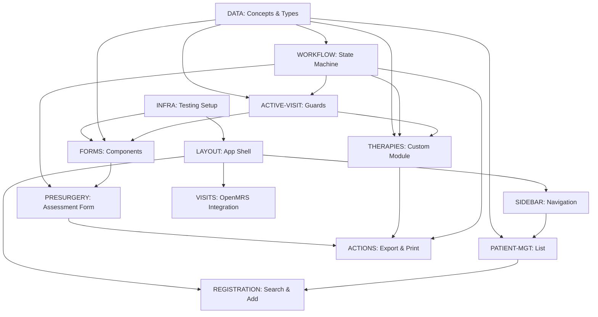

# Augen Auf OpenMRS Module - Backlog

**Project**: Ophthalmology Patient Management System
**Target**: OpenMRS 3.x ESM Framework
**Status**: Discovery & Planning Phase
**Last Updated**: 2025-10-10

## 🎯 Vision

Implement a comprehensive ophthalmology patient workflow module for OpenMRS 3.x, managing patients through 6 sequential stages (Registration → Refraction → Eye Exam → Therapy → Pre-Surgery → Surgery) with stage-specific forms, real-time "Today's Patients" tracking, and a custom therapies overview module.

---

## 🚀 4-Stream Parallel Development (Contract-First)

**4 developers, minimal dependencies, 2-3x faster delivery**

| Stream | Developer | Original Streams | Timeline | Contract Output |
|--------|-----------|------------------|----------|-----------------|
| **A: Foundation** | Dev 1 | INFRA + DATA | Week 1 | Types, validation, concepts, test-utils |
| **B: Layout & Nav** | Dev 2 | LAYOUT + SIDEBAR | Week 2-3 | Navigation API, layout slots, filter state |
| **C: Forms & Patients** | Dev 3 | FORMS + PATIENT-MGT | Week 2-4 | Form API, validation hooks, patient selection |
| **D: Workflows** | Dev 4 | WORKFLOW + PRESURGERY + ACTIONS | Week 3-6 | State machine, encounter API, export API |

**Dependency**: A → B, C → D

**See**:
- [STREAM_PARTITIONING.md](./STREAM_PARTITIONING.md) - Stream boundaries, contracts
- [CONTRACTS.md](./CONTRACTS.md) - Contract protocol, negotiation, changes
- [DISTRIBUTED_WORKFLOW.md](./DISTRIBUTED_WORKFLOW.md) - Daily workflow for 4 devs

**Contract-First**: Define interfaces upfront → Implement in parallel → Renegotiate when needed

---

## 📐 UI Layout Specification

Based on design mockups and OpenMRS integration requirements:

### Application Structure

```
┌─────────────────────────────────────────────────────────────┐
│ OpenMRS Header (Standard)                                   │
├──────────┬──────────────────────────────────────────────────┤
│          │ Top Tab Bar: Form | Visits | Conditions |       │
│ Workflow │            Therapies                              │
│ Stages   ├──────────────────────────────────────────────────┤
│ (Vert)   │                                                   │
│          │                                                   │
│ □ Reg    │         Main Content Area                        │
│ □ Refr   │   (Stage-specific form or data view)            │
│ □ Eye    │                                                   │
│ □ Ther   │                                                   │
│ □ PreSx  │                                                   │
│ □ Surg   │                                                   │
│          │                                                   │
├──────────┤                                                   │
│ Today's  │                                                   │
│ Patients │                                                   │
│ ┌──────┐ │                                                   │
│ │James │ │                                                   │
│ │Mary  │ │                                                   │
│ │Peter │ │                                                   │
│ └──────┘ │                                                   │
└──────────┴──────────────────────────────────────────────────┘
```

### Component Breakdown

#### 1. Left Sidebar (Green boxes in mockup)
- **Workflow Stages** (vertical buttons):
  - Registration (dashed red border when active)
  - Refraction
  - Eye Exam
  - Therapy
  - Pre-Surgery
  - Surgery
- **Today's Patients Panel** (green box):
  - List of patient names (James, Mary, Peter)
  - Click to select active patient
  - Selected patient highlighted

#### 2. Top Tab Navigation (Yellow boxes in mockup)
- **Registration**: Patient intake actions (New Patient button)
- **Form**: Stage-specific data entry form
- **Visits**: Encounter history view (standard OpenMRS)
- **Conditions**: Diagnosis list with active/inactive states
- **Therapies**: **NEW MODULE** - Therapy overview (red dashed box in mockup)

#### 3. Main Content Area
- **Registration Tab**:
  - "New Patient" button → Opens @openmrs/esm-patient-registration-app modal
  - Patient search interface (search box, results list)
- **Form Tab**:
  - Stage-specific forms (Refraction form, Eye Exam form, etc.)
  - Only one form per stage
- **Visits Tab**:
  - Standard OpenMRS encounters view
  - "Visits" and "All encounters" sub-tabs
  - Encounter actions: Edit, Delete
- **Conditions Tab**:
  - Standard OpenMRS conditions widget
  - Shows active/inactive conditions with symptoms
- **Therapies Tab**:
  - **CUSTOM MODULE** (watermarked "NEW MODULE")
  - Aggregated therapy notes view
  - Sections: Diagnoses, Notes, Tests, Medications, Encounters

#### 4. Active Visit Requirement
- **Modal Dialog**: "No Active Visit"
  - Message: "You can't add data to the patient chart without an active visit. Would you like to start a new visit?"
  - Buttons: "Cancel" | "Start new visit"
- **Trigger**: Attempting to edit forms without active visit

### Key UI Interactions

1. **Patient Selection**: Click patient name in "Today's Patients" → Loads patient data
2. **Stage Navigation**: Click stage button → Switches to that stage's form
3. **Tab Navigation**: Click top tab → Changes main content view
4. **New Patient**: Registration tab → "New Patient" button → Modal form
5. **Search Patient**: Registration tab → Search box → Results list → Select → Add to Today's Patients

---

## 🏗️ Work Streams (Parallelizable)

### STREAM 1: INFRA - Testing & Quality Infrastructure
**Owner**: Unassigned
**Dependencies**: None (can start immediately)
**Estimated Effort**: 2-3 hours

#### Tasks:
- [ ] Create `scripts/test.sh` - Unified test runner with --watch support
- [ ] Create `scripts/quality-gate.sh` - Combined linter + type-check + tests
- [ ] Create `scripts/check-types.sh` - TypeScript validation (handle OpenMRS dependency issues)
- [ ] Create `scripts/check-lint.sh` - ESLint runner
- [ ] Create `scripts/agent-cleanup.sh` - Pre-commit cleanup automation
- [ ] Create `scripts/pre-commit-check.sh` - Security scan + quality validation
- [ ] Configure Jest + React Testing Library for OpenMRS modules
- [ ] Add test:watch script to package.json
- [ ] Document testing strategy in `docs/testing.md`

**Acceptance Criteria**:
- All scripts executable and tested
- Scripts output minimal info on GREEN, full details on RED
- Zero tolerance quality gate (no warnings)

---

### STREAM 2: DATA - OpenMRS Concepts & Data Model
**Owner**: Unassigned
**Dependencies**: None (can start immediately)
**Estimated Effort**: 4-6 hours

#### Tasks:
- [ ] Define OpenMRS concepts for ophthalmology domain:
  - [ ] Cataract types (Incipiens, Corticalis et nucl, Subcaps post, Polaris posterior, Brunescens, Matura, Intumescens)
  - [ ] Eye laterality (Right/Left/Both)
  - [ ] BCVA measurement (decimal format)
  - [ ] Astigmatism (diopters)
  - [ ] Pterygium classification
  - [ ] Anesthesia types (ic, st/pb, AN)
  - [ ] Axial length measurement (from limbus, mm)
- [ ] Design form schema for pre-surgery assessment
- [ ] Create TypeScript types for all medical data structures
- [ ] Define validation rules for measurements (ranges, required fields)
- [ ] Create mock data generator for development/testing
- [ ] Document concept mappings in `docs/openmrs-concepts.md`

**Acceptance Criteria**:
- All concepts documented with OpenMRS UUID patterns
- TypeScript types exported from `src/types/medical.ts`
- Validation rules unit tested
- Mock data available for UI development

---

### STREAM 3: LAYOUT - Application Shell & Three-Column Layout
**Owner**: Unassigned
**Dependencies**: INFRA (testing setup)
**Estimated Effort**: 4-5 hours

#### Tasks:
- [ ] **TDD**: Write tests for three-column layout component
- [ ] Implement main app shell with OpenMRS header integration
- [ ] Create three-column grid layout:
  - [ ] **Left Column**: Workflow stages (vertical) + Today's Patients panel
  - [ ] **Middle Column**: Top tab bar + Main content area
  - [ ] Layout uses CSS Grid with fixed left column, flexible middle
- [ ] Create `src/components/Layout/AppShell.tsx`
- [ ] Create `src/components/Layout/ThreeColumnGrid.tsx`
- [ ] Implement OpenMRS ESM framework integration (@openmrs/esm-framework)
- [ ] Add CSS/styled-components for layout primitives
- [ ] Test layout responsiveness (collapse left sidebar on mobile)
- [ ] Implement layout state management (sidebar collapsed/expanded)

**Acceptance Criteria**:
- Three-column layout matches UI mockup
- Layout integrates with OpenMRS header
- Responsive behavior tested (mobile/tablet/desktop)
- Left sidebar collapsible on narrow viewports

---

### STREAM 4: SIDEBAR - Workflow Stages Navigation
**Owner**: Unassigned
**Dependencies**: LAYOUT
**Estimated Effort**: 3-4 hours

#### Tasks:
- [ ] **TDD**: Write tests for workflow stages navigation
- [ ] Implement vertical workflow stages buttons:
  - [ ] Registration (green box, red dashed border when active)
  - [ ] Refraction
  - [ ] Eye Exam
  - [ ] Therapy
  - [ ] Pre-Surgery
  - [ ] Surgery
- [ ] Create `src/components/Sidebar/WorkflowStages.tsx`
- [ ] Create `src/components/Sidebar/StageButton.tsx`
- [ ] Implement active stage highlighting (red dashed border)
- [ ] Wire up to routing (click stage → navigate to stage route)
- [ ] Add keyboard navigation support (Arrow keys, Enter)
- [ ] Integrate with workflow state machine (see WORKFLOW stream)

**Acceptance Criteria**:
- Vertical stage buttons match UI mockup
- Active stage highlighted with red dashed border
- Clicking stage navigates to stage-specific form
- Keyboard accessible (Arrow keys navigate, Enter selects)
- Stage changes update URL and main content area

---

### STREAM 5: PATIENT-MGT - Patient List & Selection
**Owner**: Unassigned
**Dependencies**: DATA (types), SIDEBAR (filter state)
**Estimated Effort**: 3-4 hours

#### Tasks:
- [ ] **TDD**: Write tests for patient list component
- [ ] Implement patient list with:
  - [ ] Active patient display (Patient 002, 003, 005)
  - [ ] Completed patient styling (grayed out)
  - [ ] Click-to-select interaction
  - [ ] Highlight selected patient
- [ ] Create `src/components/Patients/PatientList.tsx`
- [ ] Create `src/components/Patients/PatientListItem.tsx`
- [ ] Integrate with OpenMRS patient search API
- [ ] Add "Add new patient" button integration
- [ ] Implement patient selection state management
- [ ] Add loading/error states

**Acceptance Criteria**:
- Patient list fetches from OpenMRS API
- Selection state synced with URL params
- Handles empty state and errors gracefully
- Pagination if >20 patients

---

### STREAM 6: WORKFLOW - State Machine for Patient Journey
**Owner**: Unassigned
**Dependencies**: DATA (types)
**Estimated Effort**: 5-6 hours

#### Tasks:
- [ ] **TDD**: Write tests for workflow state machine
- [ ] Design state machine for patient workflow:
  ```
  Registration → Refraction → Eye Exam → [Surgery Decision] → Therapy → Finished
                                              ↓
                                         Needs Surgery (Pre-Surgery Form)
  ```
- [ ] Implement state transitions with validation
- [ ] Create `src/state/workflowMachine.ts` (using XState or custom)
- [ ] Create `src/state/workflowContext.tsx` (React Context)
- [ ] Add transition hooks (onEnter, onExit for each stage)
- [ ] Persist workflow state to OpenMRS observations
- [ ] Add audit trail for state changes
- [ ] Create workflow visualization component (optional)

**Acceptance Criteria**:
- State machine prevents invalid transitions
- State persisted to OpenMRS backend
- All transitions unit tested
- Workflow state accessible via React hooks

---

### STREAM 7: FORMS - Reusable Form Components
**Owner**: Unassigned
**Dependencies**: DATA (types), INFRA (testing)
**Estimated Effort**: 6-8 hours

#### Tasks:
- [ ] **TDD**: Write tests for all form components
- [ ] Create bilateral input component (left/right eye symmetry):
  - [ ] `src/components/Forms/BilateralInput.tsx`
  - [ ] Supports copy left→right, right→left
  - [ ] Visual indication of symmetry/asymmetry
- [ ] Create checkbox group component:
  - [ ] `src/components/Forms/CheckboxGroup.tsx`
  - [ ] Supports multi-select with validation
  - [ ] Cataract type selector variant
- [ ] Create measurement input component:
  - [ ] `src/components/Forms/MeasurementInput.tsx`
  - [ ] Handles units (dpt, mm, decimal)
  - [ ] Range validation with visual feedback
- [ ] Create BCVA input component:
  - [ ] `src/components/Forms/BCVAInput.tsx`
  - [ ] Decimal format (0.0 - 1.0)
  - [ ] Conversion helpers (Snellen, LogMAR)
- [ ] Create radio button group for anesthesia:
  - [ ] `src/components/Forms/RadioGroup.tsx`
- [ ] Add form validation library integration (React Hook Form or Formik)
- [ ] Create form state persistence (auto-save)

**Acceptance Criteria**:
- All components unit tested with Jest
- Storybook stories for visual testing (optional but recommended)
- Validation errors displayed inline
- Components follow OpenMRS Carbon design system

---

### STREAM 8: PRESURGERY - Pre-Surgery Assessment Form
**Owner**: Unassigned
**Dependencies**: FORMS (components), DATA (schema), WORKFLOW (state)
**Estimated Effort**: 8-10 hours (COMPLEX)

#### Tasks:
- [ ] **TDD**: Write tests for form validation rules
- [ ] Implement pre-surgery form layout:
  - [ ] Form header with Patient ID
  - [ ] Bilateral layout (Right eye | Left eye columns)
- [ ] Right eye section:
  - [ ] Cataract BCVA input (decimal)
  - [ ] Cataract type checkboxes (7 types)
  - [ ] Pseudophakie checkbox
  - [ ] Pterygium section with "necessary before surgery" flag
  - [ ] Astigmatism measurement (dpt)
  - [ ] Axial length (from limbus, mm)
  - [ ] Anesthesia options (ic/st/pb/AN)
- [ ] Left eye section (mirror of right eye)
- [ ] Create `src/components/PreSurgery/PreSurgeryForm.tsx`
- [ ] Create `src/components/PreSurgery/EyeAssessment.tsx`
- [ ] Implement form submission to OpenMRS encounters
- [ ] Add form validation (required fields, value ranges)
- [ ] Implement auto-save every 30 seconds
- [ ] Add "Copy from right eye" / "Copy from left eye" shortcuts
- [ ] Handle partially completed forms (save draft)

**Acceptance Criteria**:
- Form passes all validation tests
- Data saved to OpenMRS encounters with correct concept mappings
- Form state persists across browser refresh
- Bilateral data can be copied between eyes
- Error handling for save failures

---

### STREAM 9: ACTIONS - Protocol Management & Export
**Owner**: Unassigned
**Dependencies**: PRESURGERY (form data), WORKFLOW (state)
**Estimated Effort**: 4-5 hours

#### Tasks:
- [ ] **TDD**: Write tests for protocol switching
- [ ] Implement protocol tabs (Protocol 1, 2, 3):
  - [ ] `src/components/Protocols/ProtocolTabs.tsx`
  - [ ] Load protocol-specific forms
  - [ ] Persist active protocol per patient
- [ ] Implement PRINT functionality:
  - [ ] Generate PDF from form data
  - [ ] Include patient demographics
  - [ ] Format for clinical use
  - [ ] `src/services/printService.ts`
- [ ] Implement "Link to Database" export:
  - [ ] Export to external statistics DB (if applicable)
  - [ ] CSV/JSON export options
  - [ ] `src/services/exportService.ts`
- [ ] Create protocol configuration schema
- [ ] Add protocol-specific validation rules

**Acceptance Criteria**:
- Protocol switching preserves unsaved data (with confirmation)
- Print output matches clinical requirements
- Export includes all required fields
- All actions logged for audit trail

---

### STREAM 10: REGISTRATION - Patient Search & Add to Today's List
**Owner**: Unassigned
**Dependencies**: PATIENT-MGT (today's list state), LAYOUT (tab routing)
**Estimated Effort**: 4-5 hours

#### Tasks:
- [ ] **TDD**: Write tests for registration tab functionality
- [ ] Implement Registration tab content:
  - [ ] "New Patient" button → Opens @openmrs/esm-patient-registration-app modal
  - [ ] Patient search box with autocomplete
  - [ ] Search results list with patient cards (name, age, gender, OpenMRS ID)
  - [ ] "Active Visit" badge on patient cards
- [ ] Create `src/components/Registration/RegistrationTab.tsx`
- [ ] Create `src/components/Registration/PatientSearchBox.tsx`
- [ ] Create `src/components/Registration/PatientSearchResults.tsx`
- [ ] Create `src/components/Registration/PatientCard.tsx`
- [ ] Integrate @openmrs/esm-patient-registration-app for new patient form
- [ ] Implement "Add to Today's Patients" action (click patient → add to list)
- [ ] Handle existing patient check-in flow
- [ ] Add loading/error states for search

**Acceptance Criteria**:
- "New Patient" button opens standard OpenMRS registration modal
- Search returns results from OpenMRS patient API
- Clicking patient adds them to "Today's Patients" list
- Patient cards show all required info (name, age, ID, active visit badge)
- Search handles empty results gracefully

---

### STREAM 11: THERAPIES - Custom Therapy Overview Module
**Owner**: Unassigned
**Dependencies**: DATA (types), WORKFLOW (state)
**Estimated Effort**: 6-8 hours (NEW CUSTOM MODULE)

#### Tasks:
- [ ] **TDD**: Write tests for therapies module
- [ ] Design therapies data model (therapy notes, recommendations)
- [ ] Implement Therapies tab (NEW MODULE, not standard OpenMRS):
  - [ ] Aggregated therapy history view
  - [ ] Sections: Diagnoses, Notes, Tests, Medications, Encounters
  - [ ] Visit notes display (formatted text)
  - [ ] Collapsible sections with expand/collapse
- [ ] Create `src/components/Therapies/TherapiesTab.tsx`
- [ ] Create `src/components/Therapies/TherapySection.tsx`
- [ ] Create `src/components/Therapies/VisitNote.tsx`
- [ ] Implement data fetching from OpenMRS visit notes API
- [ ] Add "Create Visit Note" button (requires active visit)
- [ ] Implement visit note editor (textarea with save/cancel)
- [ ] Add date filtering (show therapies from selected date range)
- [ ] Implement print therapy summary functionality

**Acceptance Criteria**:
- Therapies tab shows aggregated therapy history
- Visit notes displayed in readable format (not raw encounter data)
- User can create new visit note (with active visit check)
- Data fetches from OpenMRS API (custom queries for visit notes)
- Module matches UI mockup ("NEW MODULE" watermark for MVP)

---

### STREAM 12: VISITS - Standard OpenMRS Encounters Integration
**Owner**: Unassigned
**Dependencies**: LAYOUT (tab routing)
**Estimated Effort**: 2-3 hours (mostly integration, using standard widgets)

#### Tasks:
- [ ] **TDD**: Write tests for visits tab integration
- [ ] Integrate standard OpenMRS visits widget:
  - [ ] Use @openmrs/esm-patient-chart widgets
  - [ ] "Visits" and "All encounters" sub-tabs
  - [ ] Encounter list with date, type, form name, provider
  - [ ] "Edit this encounter" button
  - [ ] "Delete this encounter" button
- [ ] Create `src/components/Visits/VisitsTab.tsx` (wrapper component)
- [ ] Wire up OpenMRS encounter actions (edit, delete)
- [ ] Add encounter type filtering
- [ ] Implement "No observations found" empty state
- [ ] Add loading skeleton for encounter list

**Acceptance Criteria**:
- Visits tab uses standard OpenMRS widgets
- Encounter list displays all patient encounters
- Edit/delete actions work correctly
- Sub-tabs switch between "Visits" and "All encounters" views
- Empty state shows helpful message

---

### STREAM 13: ACTIVE-VISIT - Visit Management & Guards
**Owner**: Unassigned
**Dependencies**: WORKFLOW (state), DATA (types)
**Estimated Effort**: 3-4 hours

#### Tasks:
- [ ] **TDD**: Write tests for active visit guards
- [ ] Implement "No Active Visit" modal dialog:
  - [ ] Modal triggers when user tries to edit form without active visit
  - [ ] Message: "You can't add data to the patient chart without an active visit. Would you like to start a new visit?"
  - [ ] Buttons: "Cancel" | "Start new visit"
- [ ] Create `src/components/ActiveVisit/NoActiveVisitDialog.tsx`
- [ ] Create `src/hooks/useActiveVisit.ts` - Check if patient has active visit
- [ ] Create `src/hooks/useRequireActiveVisit.ts` - Guard hook for forms
- [ ] Implement "Start new visit" action (calls OpenMRS API)
- [ ] Add active visit indicator in UI (badge or status text)
- [ ] Create visit end action (for completed patients)
- [ ] Add visit type selection (Home Visit, Facility Visit, OPD Visit)

**Acceptance Criteria**:
- Modal appears when editing form without active visit
- "Start new visit" creates visit and allows form editing
- Active visit state managed globally (React Context or Zustand)
- Forms disabled until active visit exists
- Visit type can be selected when starting visit

---

## 🔗 Dependency Graph



---

## 🚀 Quickstart for Agents

### 1. Claim a Task
```bash
# Find available tasks
grep "- \[ \]" BACKLOG.md

# Claim a task by adding your agent ID
sed -i '' 's/- \[ \] Create/- [ ] 🔒 [AGENT-1234567890] Create/' BACKLOG.md
```

### 2. Start TDD Workflow
```bash
# RED: Write failing test first
./scripts/test.sh <module> --watch

# GREEN: Implement minimal code
./scripts/test.sh <module>

# REFACTOR: Clean while green
./scripts/test.sh <module> --watch
```

### 3. Run Quality Gate Before Commit
```bash
./scripts/quality-gate.sh  # Must be 100% GREEN
./scripts/agent-cleanup.sh
git commit -m "Add <feature> to <achieve value>"
```

---

## 📋 Current Sprint Focus

**Iteration 1: Foundation** (Week 1)
- STREAM 1: INFRA (must complete first)
- STREAM 2: DATA (parallel to INFRA)
- STREAM 3: LAYOUT (after INFRA)

**Iteration 2: Navigation & State** (Week 2)
- STREAM 4: SIDEBAR (workflow stages)
- STREAM 5: PATIENT-MGT (today's patients panel)
- STREAM 6: WORKFLOW (state machine)
- STREAM 13: ACTIVE-VISIT (visit guards)

**Iteration 3: Forms & Components** (Weeks 3-4)
- STREAM 7: FORMS (reusable components, start early)
- STREAM 10: REGISTRATION (patient search)
- STREAM 12: VISITS (OpenMRS integration, quick)

**Iteration 4: Feature Modules** (Weeks 5-6)
- STREAM 8: PRESURGERY (complex bilateral form)
- STREAM 11: THERAPIES (custom module)

**Iteration 5: Actions & Polish** (Week 7)
- STREAM 9: ACTIONS (export, print, protocols)
- Integration testing
- User acceptance testing

---

## 🔐 Agent Locks

**Format**: `🔒 [AGENT-{ID}] {task} - {timestamp}`

Example:
```markdown
- [ ] 🔒 [AGENT-1728561234] Create scripts/test.sh - 2025-10-10T14:30:00Z
```

**Lock expiration**: 15 minutes of inactivity = stale lock

---

## ✅ Completion Checklist

Before marking the project DONE:

- [ ] All 13 streams completed (INFRA, DATA, LAYOUT, SIDEBAR, PATIENT-MGT, WORKFLOW, FORMS, PRESURGERY, ACTIONS, REGISTRATION, THERAPIES, VISITS, ACTIVE-VISIT)
- [ ] E2E tests pass for full patient workflow (Registration → Refraction → Eye Exam → Therapy → Pre-Surgery → Surgery)
- [ ] Active visit management tested (guards, start visit, end visit)
- [ ] Patient search and "Today's Patients" functionality working
- [ ] Therapies custom module complete with visit notes
- [ ] Documentation complete (user guide, API docs, concept mappings)
- [ ] Performance tested (load 100+ patients in today's list)
- [ ] Accessibility audit passed (WCAG 2.1 AA)
- [ ] Security review completed (no PII leaks, PHI protection)
- [ ] OpenMRS community demo prepared
- [ ] Deployment guide for production

---

**VERSION**: 1.0.0
**PROTOCOL**: Agent Protocol v1.1
**ENFORCEMENT**: TDD Mandatory | Quality Gate Zero-Tolerance
