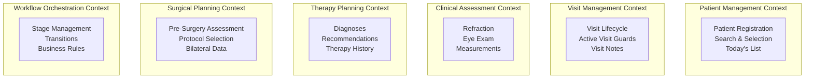

# Domain-Driven Design Discovery Workshop
## Augen Auf OpenMRS Module - Ophthalmology Patient Workflow Management

**Workshop Date**: 2025-10-10
**Facilitator**: DDD Discovery Agent
**Domain**: Ophthalmology Clinical Workflow
**Project**: OpenMRS 3.x Frontend Module

---

## Executive Summary

This document captures the outcomes of a comprehensive Domain-Driven Design discovery workshop for the Augen Auf OpenMRS module. Through Event Storming, Context Mapping, and Domain Modeling exercises, we have identified **6 bounded contexts**, **42 domain events**, and **8 key aggregates** that form the foundation of the ophthalmology patient management system.

The system manages patients through a sequential clinical workflow with 6 stages (Registration → Refraction → Eye Exam → Therapy → Pre-Surgery → Surgery), each representing distinct clinical activities with specific data requirements and business rules.

---

## Phase 1: Event Storming - Big Picture

### Domain Events Timeline

```
┌─────────────────────────────────────────────────────────────────────────────┐
│                        Patient Journey Event Flow                           │
├─────────────────────────────────────────────────────────────────────────────┤
│                                                                             │
│  Registration                                                               │
│  ───────────                                                               │
│  PatientSearched → PatientFound/NotFound                                   │
│      ↓                    ↓                                                │
│  PatientSelected    NewPatientInitiated                                    │
│      ↓                    ↓                                                │
│  PatientAddedToTodaysList  PatientRegistered                              │
│      ↓                    ↓                                                │
│  ActiveVisitRequired → VisitStarted                                        │
│                           ↓                                                 │
│                                                                             │
│  Clinical Assessment                                                        │
│  ──────────────────                                                        │
│  WorkflowStageEntered → FormOpened                                         │
│      ↓                                                                      │
│  MeasurementRecorded → ValidationFailed/Passed                             │
│      ↓                                                                      │
│  BilateralDataCopied → FormAutoSaved                                       │
│      ↓                                                                      │
│  FormSubmitted → EncounterCreated                                          │
│      ↓                                                                      │
│  WorkflowStageCompleted → NextStageUnlocked                                │
│                                                                             │
│  Therapy Planning                                                          │
│  ───────────────                                                           │
│  DiagnosisRecorded → TherapyRecommended                                    │
│      ↓                                                                      │
│  SurgeryDecisionMade → PreSurgeryAssessmentRequired                        │
│      ↓                          ↓                                           │
│  VisitNoteSaved        PreSurgeryFormCompleted                             │
│      ↓                          ↓                                           │
│  TherapiesAggregated    ProtocolSelected                                   │
│                                 ↓                                           │
│                         SurgeryScheduled                                    │
│                                                                             │
│  Administrative                                                            │
│  ──────────────                                                            │
│  DataExported → PrintRequested → PDFGenerated                              │
│  VisitEnded → PatientMarkedComplete                                        │
│                                                                             │
└─────────────────────────────────────────────────────────────────────────────┘
```

### Key Domain Events

#### Patient Management Events
- **PatientSearched**: User searches for existing patient
- **PatientFound/NotFound**: Search results returned
- **PatientSelected**: User selects patient from search results
- **NewPatientInitiated**: User starts new patient registration
- **PatientRegistered**: New patient created in system
- **PatientAddedToTodaysList**: Patient added to daily workflow queue
- **PatientMarkedComplete**: Patient workflow finished for the day

#### Visit Management Events
- **ActiveVisitRequired**: System detects no active visit for data entry
- **VisitStarted**: New visit created for patient
- **VisitEnded**: Current visit closed
- **VisitNoteSaved**: Free-text note added to visit

#### Workflow Events
- **WorkflowStageEntered**: User navigates to specific stage
- **WorkflowStageCompleted**: All requirements for stage met
- **NextStageUnlocked**: Subsequent stage becomes available
- **SurgeryDecisionMade**: Clinical decision point reached

#### Clinical Data Events
- **FormOpened**: Stage-specific form displayed
- **MeasurementRecorded**: Clinical measurement entered
- **ValidationFailed/Passed**: Data validation result
- **BilateralDataCopied**: Left/right eye data synchronized
- **FormAutoSaved**: Draft data persisted
- **FormSubmitted**: Final data committed
- **EncounterCreated**: OpenMRS encounter recorded

#### Therapy Events
- **DiagnosisRecorded**: Clinical diagnosis documented
- **TherapyRecommended**: Treatment plan created
- **PreSurgeryAssessmentRequired**: Surgery pathway triggered
- **ProtocolSelected**: Surgical protocol chosen
- **TherapiesAggregated**: Historical therapies compiled

### Actors and Commands

| Actor | Commands | Events Triggered |
|-------|----------|-----------------|
| **Receptionist** | Search Patient, Register New Patient, Add to Today's List | PatientSearched, PatientRegistered, PatientAddedToTodaysList |
| **Nurse** | Start Visit, Enter Refraction Data, Record Eye Exam | VisitStarted, MeasurementRecorded, EncounterCreated |
| **Doctor** | Make Diagnosis, Plan Therapy, Decide Surgery, Complete Pre-Surgery | DiagnosisRecorded, TherapyRecommended, SurgeryDecisionMade, PreSurgeryFormCompleted |
| **Administrator** | Export Data, Generate Reports | DataExported, PDFGenerated |
| **System** | Auto-save Forms, Validate Data, Enforce Rules | FormAutoSaved, ValidationFailed/Passed, ActiveVisitRequired |

---

## Phase 2: Bounded Context Identification

### Discovered Bounded Contexts



### Context Classifications (DDD Strategic Design)

| Bounded Context | Classification | Rationale |
|-----------------|---------------|-----------|
| **Workflow Orchestration** | **Core Domain** | Unique competitive advantage - sequential ophthalmology workflow |
| **Clinical Assessment** | **Core Domain** | Specialized ophthalmology measurements and validations |
| **Surgical Planning** | **Core Domain** | Complex bilateral assessment with specific business rules |
| **Therapy Planning** | **Supporting Domain** | Important but not unique - standard medical recommendations |
| **Patient Management** | **Generic Subdomain** | Standard functionality - leverage OpenMRS components |
| **Visit Management** | **Generic Subdomain** | Standard OpenMRS pattern - use framework capabilities |

---

## Phase 3: Context Mapping

### Context Relationship Map

```
┌──────────────────────────────────────────────────────────────┐
│                   Context Relationships                       │
├──────────────────────────────────────────────────────────────┤
│                                                              │
│  [Patient Management] ←─Customer/Supplier─→ [OpenMRS Core]   │
│           ↓                                                   │
│      Shared Kernel                                           │
│           ↓                                                   │
│  [Visit Management] ←─Conformist─→ [OpenMRS Visit API]      │
│           ↓                                                   │
│      Published Language                                      │
│           ↓                                                   │
│  [Workflow Orchestration] ←─Upstream─→ All Other Contexts   │
│           ↓                                                   │
│      Open Host Service                                       │
│        ↙     ↘                                              │
│  [Clinical]  [Therapy] ←─Partnership─→ [Surgical Planning]  │
│                                                              │
│  [Surgical Planning] ←─ACL─→ [External Stats Database]       │
│                                                              │
└──────────────────────────────────────────────────────────────┘
```

### Integration Patterns

| Upstream Context | Downstream Context | Pattern | Implementation |
|------------------|-------------------|---------|----------------|
| OpenMRS Core | Patient Management | **Conformist** | Use OpenMRS patient API directly |
| OpenMRS Visit API | Visit Management | **Conformist** | Adopt OpenMRS visit model |
| Workflow Orchestration | All Contexts | **Open Host Service** | State machine with events |
| Clinical Assessment | Surgical Planning | **Shared Kernel** | Common measurement types |
| Therapy Planning | Surgical Planning | **Partnership** | Coordinated therapy decisions |
| Surgical Planning | External Database | **Anti-Corruption Layer** | Transform to export format |

---

## Phase 4: Domain Models

### 1. Patient Management Context

#### Aggregates
```typescript
// Aggregate: PatientSelection
interface PatientSelection {
  // Aggregate Root
  selectedPatientId: PatientId;

  // Entities
  todaysPatients: TodaysPatient[];

  // Value Objects
  searchCriteria: SearchCriteria;
  dateFilter: DateRange;

  // Domain Services
  searchPatients(criteria: SearchCriteria): Patient[];
  addToTodaysList(patientId: PatientId): void;
  removeFromTodaysList(patientId: PatientId): void;
}

// Entity: TodaysPatient
interface TodaysPatient {
  patientId: PatientId;
  addedAt: Timestamp;
  currentStage: WorkflowStage;
  visitStatus: VisitStatus;
  completedStages: WorkflowStage[];
}

// Value Objects
type PatientId = string; // OpenMRS UUID
type VisitStatus = 'no-visit' | 'active-visit' | 'visit-ended';
interface SearchCriteria {
  name?: string;
  identifier?: string;
  phoneNumber?: string;
}
```

### 2. Visit Management Context

#### Aggregates
```typescript
// Aggregate: ActiveVisit
interface ActiveVisit {
  // Aggregate Root
  visitId: VisitId;

  // Entities
  encounters: Encounter[];
  visitNotes: VisitNote[];

  // Value Objects
  patientId: PatientId;
  visitType: VisitType;
  startDateTime: DateTime;
  endDateTime?: DateTime;

  // Business Rules
  canAddData(): boolean; // Must have active visit
  canEndVisit(): boolean; // All required stages complete
}

// Entity: VisitNote
interface VisitNote {
  noteId: NoteId;
  authorId: UserId;
  timestamp: DateTime;
  content: string; // Free text
  category: 'therapy' | 'observation' | 'plan';
}
```

### 3. Clinical Assessment Context

#### Aggregates
```typescript
// Aggregate: ClinicalAssessment
interface ClinicalAssessment {
  // Aggregate Root
  assessmentId: AssessmentId;

  // Entities
  refractionMeasurement?: RefractionData;
  eyeExamination?: EyeExamData;

  // Value Objects
  patientId: PatientId;
  assessmentDate: Date;
  assessedBy: UserId;

  // Domain Services
  validateMeasurement(measurement: Measurement): ValidationResult;
  calculateBilateralSymmetry(): SymmetryScore;
}

// Value Object: BilateralMeasurement<T>
interface BilateralMeasurement<T> {
  left: T;
  right: T;

  // Domain Logic
  copyLeftToRight(): BilateralMeasurement<T>;
  copyRightToLeft(): BilateralMeasurement<T>;
  isSymmetric(tolerance: number): boolean;
}

// Value Object: BCVA (Best Corrected Visual Acuity)
class BCVA {
  constructor(private value: number) {
    if (value < 0 || value > 1) {
      throw new Error('BCVA must be between 0.0 and 1.0');
    }
  }

  toSnellen(): string { /* conversion logic */ }
  toLogMAR(): number { /* conversion logic */ }
}
```

### 4. Therapy Planning Context

#### Aggregates
```typescript
// Aggregate: TherapyPlan
interface TherapyPlan {
  // Aggregate Root
  planId: PlanId;

  // Entities
  diagnoses: Diagnosis[];
  recommendations: TherapyRecommendation[];

  // Value Objects
  patientId: PatientId;
  createdBy: UserId;
  createdAt: DateTime;

  // Domain Services
  aggregateHistoricalTherapies(): TherapySummary;
  requiresSurgery(): boolean;
}

// Entity: Diagnosis
interface Diagnosis {
  diagnosisId: DiagnosisId;
  conceptId: ConceptId; // OpenMRS concept
  laterality: 'left' | 'right' | 'bilateral';
  severity: 'mild' | 'moderate' | 'severe';
  dateRecorded: Date;
}

// Entity: TherapyRecommendation
interface TherapyRecommendation {
  recommendationId: RecommendationId;
  type: 'medication' | 'procedure' | 'surgery' | 'observation';
  description: string;
  urgency: 'routine' | 'urgent' | 'emergency';
}
```

### 5. Surgical Planning Context

#### Aggregates
```typescript
// Aggregate: SurgicalAssessment
interface SurgicalAssessment {
  // Aggregate Root
  assessmentId: AssessmentId;

  // Entities
  leftEyeAssessment: EyeSurgicalData;
  rightEyeAssessment: EyeSurgicalData;

  // Value Objects
  selectedProtocol: Protocol;
  anesthesiaType: AnesthesiaType;
  scheduledDate?: Date;

  // Business Rules
  validateCataractTypes(): ValidationResult;
  checkPterygiumRequirement(): boolean;
  calculateIOLPower(): IOLCalculation;
}

// Entity: EyeSurgicalData
interface EyeSurgicalData {
  bcva: BCVA;
  cataractTypes: CataractType[];
  pseudophakie: boolean;
  pterygium?: {
    present: boolean;
    surgeryRequired: boolean;
  };
  astigmatism: Diopters;
  axialLength: Millimeters;
}

// Value Object: CataractType
type CataractType =
  | 'Incipiens'
  | 'Corticalis et nucl'
  | 'Subcapsularis posterior'
  | 'Polaris posterior'
  | 'Brunescens'
  | 'Matura'
  | 'Intumescens';

// Value Object: Protocol
interface Protocol {
  protocolId: 'protocol1' | 'protocol2' | 'protocol3';
  name: string;
  steps: ProtocolStep[];
}
```

### 6. Workflow Orchestration Context

#### Aggregates
```typescript
// Aggregate: PatientWorkflow
interface PatientWorkflow {
  // Aggregate Root
  workflowId: WorkflowId;

  // Entities
  stages: WorkflowStage[];
  currentStage: WorkflowStage;

  // Value Objects
  patientId: PatientId;
  startedAt: DateTime;
  completedAt?: DateTime;

  // State Machine
  transitionTo(nextStage: WorkflowStage): TransitionResult;
  canTransitionTo(stage: WorkflowStage): boolean;
  getAvailableTransitions(): WorkflowStage[];

  // Business Rules
  enforceSequentialProgression(): void;
  validateStageCompletion(): ValidationResult;
}

// Entity: WorkflowStage
interface WorkflowStage {
  stageName: StageName;
  status: 'not-started' | 'in-progress' | 'completed' | 'skipped';
  enteredAt?: DateTime;
  completedAt?: DateTime;
  requiredForms: FormId[];
  completedForms: FormId[];

  // Stage-specific rules
  isComplete(): boolean;
  canSkip(): boolean;
  getRequirements(): Requirement[];
}

// Value Object: StageName
type StageName =
  | 'registration'
  | 'refraction'
  | 'eye-exam'
  | 'therapy'
  | 'pre-surgery'
  | 'surgery';

// Domain Service: WorkflowEngine
interface WorkflowEngine {
  startWorkflow(patientId: PatientId): PatientWorkflow;
  progressWorkflow(workflowId: WorkflowId, event: DomainEvent): void;
  enforceBusinessRules(workflow: PatientWorkflow): ValidationResult[];
}
```

---

## Phase 5: Ubiquitous Language

### Core Domain Terminology

| Term | Definition | Context | Not to be confused with |
|------|-----------|---------|------------------------|
| **Today's Patients** | Pre-selected list of patients scheduled for clinical workflow on current day | Patient Management | Patient queue (auto-generated) |
| **Active Visit** | Open clinical session allowing data entry for a patient | Visit Management | Appointment or scheduled visit |
| **Workflow Stage** | Discrete step in ophthalmology clinical process | Workflow Orchestration | Form, encounter, or visit |
| **Check-in** | Process of adding existing patient to Today's Patients list | Patient Management | Registration (new patient) |
| **Bilateral Data** | Paired measurements for left and right eyes | Clinical/Surgical | Binocular (both eyes together) |
| **BCVA** | Best Corrected Visual Acuity - decimal measure 0.0-1.0 | Clinical Assessment | Uncorrected visual acuity |
| **Cataract Type** | Classification of lens opacity pattern | Surgical Planning | Cataract severity |
| **Pseudophakie** | State of having artificial lens implant | Surgical Planning | Phakic (natural lens) |
| **Pterygium** | Fibrovascular growth on cornea | Surgical Planning | Pinguecula (different growth) |
| **Protocol** | Standardized surgical procedure template | Surgical Planning | Clinical guideline |
| **Encounter** | Structured clinical data entry event | Visit Management | Visit (container for encounters) |
| **Visit Note** | Free-text clinical observation | Therapy Planning | Encounter (structured data) |
| **Therapy** | Treatment recommendation or intervention | Therapy Planning | Prescription (medication only) |
| **Form** | Data entry interface for specific stage | All Contexts | Document or report |
| **Axial Length** | Eye measurement from cornea to retina | Surgical Planning | Anterior chamber depth |
| **Anesthesia Type** | Method of numbing (ic/st/pb/AN) | Surgical Planning | Sedation level |

### Business Rules Expressed in Ubiquitous Language

1. **"No data can be added without an Active Visit"**
   - Guards all clinical data entry
   - Enforced by Visit Management Context

2. **"Each Workflow Stage has exactly one Form"**
   - Simplifies data collection
   - Managed by Workflow Orchestration

3. **"Bilateral Data can be copied but not enforced"**
   - Clinician discretion on symmetry
   - Implemented in Clinical Assessment

4. **"Today's Patients list is manually curated"**
   - Not auto-generated from appointments
   - Controlled by Patient Management

5. **"Therapy aggregates all Visit Notes"**
   - Historical view of recommendations
   - Compiled by Therapy Planning

6. **"Pre-Surgery requires Surgery Decision"**
   - Conditional workflow branching
   - Orchestrated by Workflow Context

---

## Implementation Recommendations

### Priority 1: Core Domain Contexts (Week 1-3)

#### Workflow Orchestration Context
- **Technology**: XState or custom state machine
- **Key Deliverable**: State machine enforcing stage progression
- **Critical Path**: Yes - blocks all other features
- **Team**: Stream D (Senior developer recommended)

#### Clinical Assessment Context
- **Technology**: React Hook Form + Zod validation
- **Key Deliverable**: Bilateral form components with validation
- **Critical Path**: Yes - core data entry
- **Team**: Stream C

#### Surgical Planning Context
- **Technology**: Complex form with auto-save
- **Key Deliverable**: Pre-surgery assessment form
- **Critical Path**: Yes - primary business value
- **Team**: Stream D (after workflow)

### Priority 2: Supporting Domain (Week 2-4)

#### Therapy Planning Context
- **Technology**: Custom module with aggregation logic
- **Key Deliverable**: Therapy overview with visit notes
- **Critical Path**: No - can be delivered later
- **Team**: Stream D (parallel to surgical)

### Priority 3: Generic Subdomains (Week 1-2)

#### Patient Management Context
- **Technology**: OpenMRS patient search API + custom list
- **Key Deliverable**: Today's Patients panel
- **Critical Path**: No - can use mock data initially
- **Team**: Stream C

#### Visit Management Context
- **Technology**: OpenMRS visit framework
- **Key Deliverable**: Active visit guards
- **Critical Path**: Partial - guards needed early
- **Team**: Stream B (with layout)

### Anti-Corruption Layers

1. **OpenMRS Patient API → Patient Management**
   - Transform OpenMRS patient model to simplified domain model
   - Hide REST API complexity

2. **OpenMRS Encounter API → Clinical Assessment**
   - Map form data to OpenMRS observations
   - Handle concept UUID translation

3. **External Database → Surgical Planning Export**
   - Transform domain model to export format
   - Handle data anonymization if required

### Event-Driven Integration

```typescript
// Domain Events for Context Communication
interface DomainEvent {
  eventId: string;
  aggregateId: string;
  eventType: string;
  payload: any;
  occurredAt: DateTime;
}

// Key Integration Events
class PatientAddedToTodaysList implements DomainEvent { }
class ActiveVisitStarted implements DomainEvent { }
class WorkflowStageCompleted implements DomainEvent { }
class PreSurgeryAssessmentCompleted implements DomainEvent { }
class TherapyRecommended implements DomainEvent { }
```

---

## Risk Assessment & Mitigation

### Technical Risks

| Risk | Impact | Probability | Mitigation |
|------|--------|-------------|------------|
| OpenMRS API changes | High | Low | Anti-corruption layer, version pinning |
| Complex bilateral form state | Medium | High | Dedicated state management, extensive testing |
| Workflow state persistence | High | Medium | Event sourcing pattern, audit trail |
| Performance with many patients | Medium | Medium | Pagination, virtual scrolling |

### Domain Risks

| Risk | Impact | Probability | Mitigation |
|------|--------|-------------|------------|
| Misunderstood clinical workflow | High | Medium | Regular clinician review, iterative development |
| Incomplete validation rules | High | Medium | Comprehensive test suite, clinical SME review |
| Data integrity (bilateral sync) | High | Low | Transactional updates, validation |
| Regulatory compliance | High | Low | Audit trail, data encryption, access control |

---

## Next Steps for Development Team

### Immediate Actions (This Sprint)

1. **Set up bounded context folders**:
   ```
   src/contexts/
   ├── patient-management/
   ├── visit-management/
   ├── clinical-assessment/
   ├── therapy-planning/
   ├── surgical-planning/
   └── workflow-orchestration/
   ```

2. **Define context contracts** (see CONTRACTS.md):
   - Start with Workflow Orchestration API
   - Clinical Assessment validation interfaces
   - Patient Management selection API

3. **Create shared kernel**:
   ```typescript
   // src/shared-kernel/
   - BilateralData<T>
   - BCVA value object
   - Common validation types
   - Domain event base classes
   ```

4. **Implement first vertical slice**:
   - Patient selection → Active visit check → Open form
   - Proves integration between 3 contexts

### Sprint 2 Focus

- Complete Workflow Orchestration state machine
- Implement Clinical Assessment forms (3 components)
- Integrate with OpenMRS patient API

### Sprint 3-4 Focus

- Surgical Planning complex form
- Therapy Planning aggregation
- Export/print functionality

### Definition of Done

Each bounded context must have:
- ✅ Clear aggregate boundaries
- ✅ Published contract (API)
- ✅ Unit tests (>80% coverage for domain logic)
- ✅ Integration tests with other contexts
- ✅ Documentation of business rules
- ✅ Event catalog
- ✅ Error handling strategy

---

## Conclusion

This discovery workshop has revealed a rich domain model with clear bounded context boundaries aligned with clinical workflow stages. The **Workflow Orchestration**, **Clinical Assessment**, and **Surgical Planning** contexts form the core domain providing unique business value.

By following Domain-Driven Design principles, the team can develop these contexts in parallel while maintaining clear integration points through well-defined contracts and domain events. The ubiquitous language established here should be used consistently across code, documentation, and team communication.

The modular architecture emerging from these bounded contexts will enable:
- Independent development and deployment
- Clear ownership and responsibilities
- Focused domain expertise
- Easier testing and maintenance
- Future extensibility for additional clinical workflows

### Success Metrics

- **Business**: 50% reduction in patient data entry time
- **Technical**: <5% defect rate in production
- **Domain**: 100% clinical workflow compliance
- **Team**: 4 developers working in parallel with <2 blocking issues/week

---

**Workshop Output Version**: 1.0.0
**Next Review**: After Sprint 2
**Contact**: DDD Discovery Facilitator
**Status**: Ready for Implementation Planning